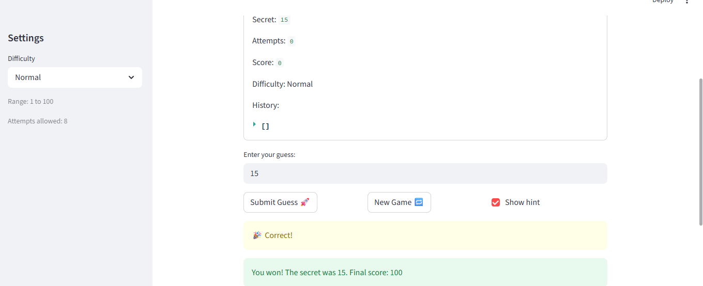
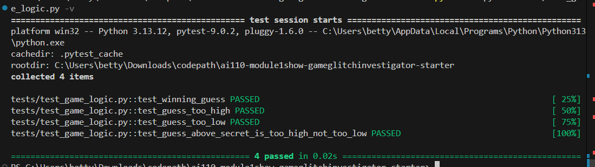

# 🎮 Game Glitch Investigator: The Impossible Guesser

## 🚨 The Situation

You asked an AI to build a simple "Number Guessing Game" using Streamlit.
It wrote the code, ran away, and now the game is unplayable. 

- You can't win.
- The hints lie to you.
- The secret number seems to have commitment issues.

## 🛠️ Setup

1. Install dependencies: `pip install -r requirements.txt`
2. Run the broken app: `python -m streamlit run app.py`

## 🕵️‍♂️ Your Mission

1. **Play the game.** Open the "Developer Debug Info" tab in the app to see the secret number. Try to win.
2. **Find the State Bug.** Why does the secret number change every time you click "Submit"? Ask ChatGPT: *"How do I keep a variable from resetting in Streamlit when I click a button?"*
3. **Fix the Logic.** The hints ("Higher/Lower") are wrong. Fix them.
4. **Refactor & Test.** - Move the logic into `logic_utils.py`.
   - Run `pytest` in your terminal.
   - Keep fixing until all tests pass!

## 📝 Document Your Experience

**Game purpose:**
A number guessing game where the player picks a difficulty, then guesses a secret number within a limited number of attempts. The game gives hints after each guess and tracks a score out of 100.

**Bugs found:**
1. Hard difficulty range was 1–50, easier than Normal (1–100)
2. Hints were wrong on every other attempt due to the secret being cast to a string, causing lexicographic comparison
3. Attempts counter started at 1 instead of 0, silently using up one attempt before the first guess
4. Info banner was hardcoded to "between 1 and 100" regardless of difficulty
5. New Game always picked a number between 1 and 100, ignoring the selected difficulty
6. New Game did not reset history or score from the previous game
7. Wrong guesses on even-numbered attempts gave +5 points instead of deducting 5
8. Win scoring formula used `+1` instead of `-1`, so a first-attempt win gave 80 instead of 100

**Fixes applied:**
- Fixed Hard range to (1, 1000)
- Removed string cast on even attempts so comparisons are always integer-based
- Changed initial attempts value from 1 to 0
- Updated info banner to use the actual `low` and `high` values from the selected difficulty
- Fixed New Game to call `randint(low, high)` and reset history and score
- Removed the even-attempt +5 bonus for wrong guesses
- Changed win formula from `attempt_number + 1` to `attempt_number - 1`
- Refactored all game logic functions out of `app.py` into `logic_utils.py`

## 📸 Demo

- [ ] 

## ✅ pytest Results (Challenge 1)

- [ ] 

## 🚀 Stretch Features

- [ ] [If you choose to complete Challenge 4, insert a screenshot of your Enhanced Game UI here]
